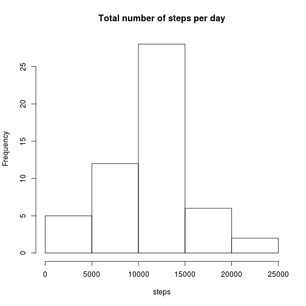
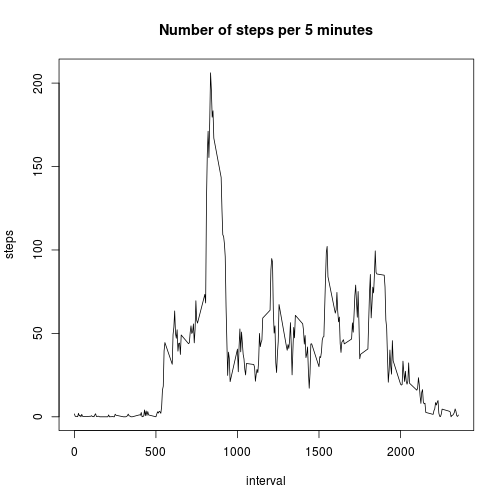
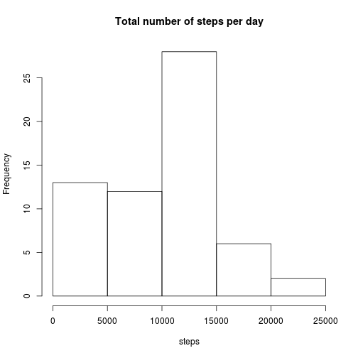
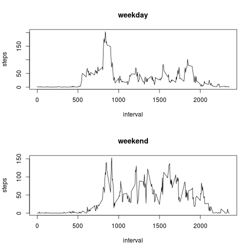

## Loading and preprocessing the data

```r
data=read.csv("activity.csv")
```

## What is mean total number of steps taken per day?

```r
dataSPD=aggregate(data$steps, by=list(date=data$date), FUN=sum)
names(dataSPD)[2]="steps"

hist(dataSPD$steps,xlab="steps", main="Total number of steps per day")
```



```r
print(meanStep)
```

```
## Error in print(meanStep): object 'meanStep' not found
```

```r
medianStep=median(dataSPD$steps, na.rm=TRUE)
print(medianStep)
```

```
## [1] 10765
```


## What is the average daily activity pattern?

```r
dataComplete=data[complete.cases(data),]
dataInterval=aggregate(dataComplete$steps, by=list(interval=dataComplete$interval), FUN=mean)
names(dataInterval)[2]="steps"
with(dataInterval,plot(interval,steps,type="l"))
title(main="Number of steps per 5 minutes")
```



```r
maxInterval=dataInterval[which.max(dataInterval$steps),1]
print(maxInterval)
```

```
## [1] 835
```

## Imputing missing values

```r
# 1. total number of missing values
numberOfNA=nrow(data)-nrow(dataComplete)

# 2&3. Filling missing values.
dataFill=data
for(i in 1:nrow(data)){
    if(is.na(data[i,1])){
	intervalIndex=which(dataInterval[,1]==100)
	dataFill[i,1]=dataInterval[intervalIndex,2]
	    }
}

# 4. histogram, mean & median 
dataSPD=aggregate(dataFill$steps, by=list(date=dataFill$date), FUN=sum)
names(dataSPD)[2]="steps"
hist(dataSPD$steps,xlab="steps", main="Total number of steps per day")
```



```r
meanStep=mean(dataSPD$steps)
print(meanStep)
```

```
## [1] 9366.345
```

```r
medianStep=median(dataSPD$steps)
print(medianStep)
```

```
## [1] 10395
```

## Are there differences in activity patterns between weekdays and weekends?


```r
#create a new column for weekdays
dataFill$weekday="weekday"

#filling the new column based on date
for(i in 1:nrow(dataFill)){
    x=as.Date(dataFill[i,2]);
    if(weekdays(x)=="Saturday" || weekdays(x)=="Sunday"){
	dataFill$weekday[i]="weekend"
    }
}
dataFill$weekday=as.factor(dataFill$weekday)

dataInterval=aggregate(dataFill$steps, by=list(interval=dataFill$interval, weekday=dataFill$weekday), FUN=mean)
names(dataInterval)[3]="steps"

par(mfrow=c(2,1))
with(subset(dataInterval, weekday=="weekday"),plot(interval,steps,type='l'))

title(main="weekday")

with(subset(dataInterval, weekday=="weekend"),plot(interval,steps,type='l'))
title(main="weekend")
```



